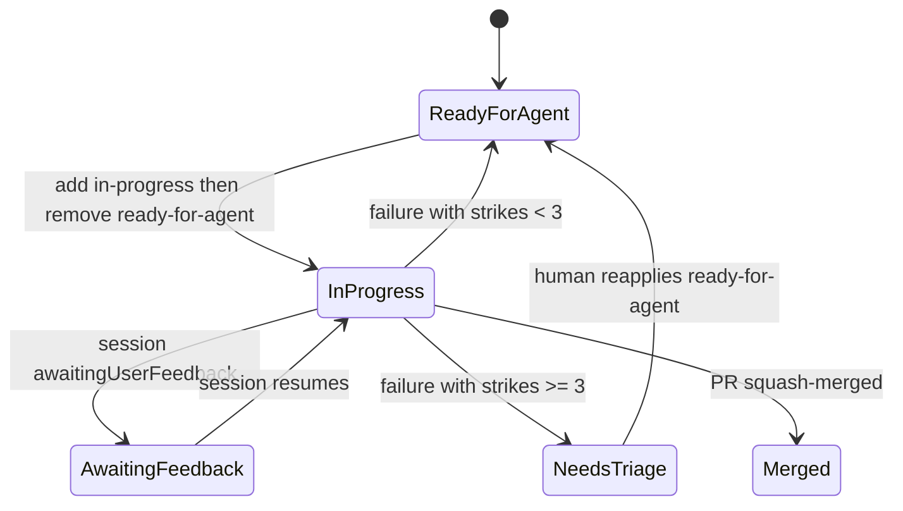

# ADR-033: Fleet label-driven dispatch adoption with 3-strikes abort

## Status

Accepted — extends ADR-019

## Date

2026-06-22

## Context

Tier 2 fleet dispatch needs deterministic issue visibility and failure recovery.
Planner input must include only `ready-for-agent` issues, while active sessions
remain visible through label transitions and explicit audit comments.

HSI ADR-030 defines label-driven dispatch. This repository adopts that model
with one local addition: a 3-strikes abort to `needs-triage`, including reset
semantics.

## Decision

Adopt HSI ADR-030's label-driven dispatch model with these local rules:

1. Planner input is label-scoped to `ready-for-agent`.
2. Dispatcher transitions labels in this order before `jules.run()`:
   - add `in-progress`
   - remove `ready-for-agent`
3. Dispatch comments include a collapsed `
` block containing the exact
   `task.prompt`.
4. Label transitions are not treated as an atomic mutex; workflow-level
   concurrency is the mutex.
5. Failure recovery uses strike counting over paginated issue label events:
   - strikes = `in-progress` label-add events in last 30 days
   - counted only after the most recent human `ready-for-agent` apply
   - reset anchor also advances on merged-close events
   - strike 1-2: restore `ready-for-agent`
   - strike 3+: transition to `needs-triage`

## Alternatives considered

- Keep broad planner input (all open issues). Rejected: mixes active, blocked,
  and triage-required issues into one dispatch pass.
- Treat labels as the concurrency mutex. Rejected: GitHub label mutations are
  not compare-and-swap atomic.
- Always restore `ready-for-agent` on failures. Rejected: repeated failures
  without escalation hide dispatch dead-ends.

## Consequences

### Positive

- Planner workload is reduced to dispatch-ready items only.
- Operators can see session state transitions directly on issues.
- Repeated failures escalate to `needs-triage` automatically.
- Workflow concurrency provides deterministic serialization of dispatch runs.

### Negative / Trade-offs

- More label mutation API calls per dispatch attempt.
- Strike counting depends on issue-event history quality and pagination.
- Merge/reset semantics require consistent issue linkage to fleet task manifests.

## Reversibility

This adoption tracks HSI ADR-030 (currently Proposed). If HSI promotes, amends,
or rejects ADR-030, re-review ADR-033 within 14 days and amend this ADR if
local behavior should change.

## Related decisions

- [`ADR-019`](ADR-019-fleet-jules-orchestration.md) — baseline fleet orchestration.
- [`ADR-032`](ADR-032-fleet-quota-saturation-soft-warn.md) — quota-saturation
  behavior for fleet mutation failures.
- [`ADR-034`](ADR-034-fleet-no-notification-on-quota-saturation.md) — adopts
  no-notification policy for quota saturation events.

## References

- `repo://wryenmeek/hot-springs-island/docs/decisions/ADR-030-fleet-label-driven-dispatch.md@8e125919652bc10ad0a27e9ea1f0837134f67c93#asset?sha256=2de357a09057a3aa3def436c13b8e65a769a653bd189362f447eb86b14a3f3e5`
- Issue #350
- Issue #348
- `scripts/fleet/fleet-plan.ts`
- `scripts/fleet/fleet-dispatch.ts`
- `.github/workflows/fleet-dispatch-after-merge.yml`
