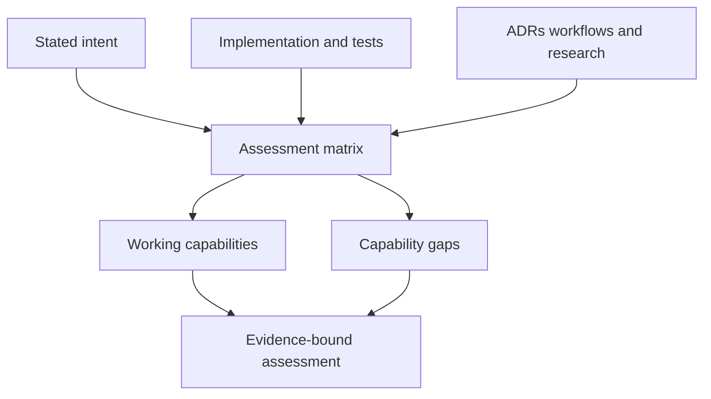

# docs: Assess Knowledgebase Design Intent

## Summary

Produce an evidence-bound assessment of what Knowledgebase is intended to do, which capabilities are demonstrably working, and where its current implementation or operational posture falls short of that intent. The assessment will distinguish implemented behavior from documented scaffolding, deferred work, and unsupported assumptions.

---

## Problem Frame

Knowledgebase presents itself as a self-contained, deterministic, provenance-first, policy-gated knowledgebase. Its architecture spans source ingest, curated Markdown, validation, semantic retrieval, governed persistence, automation, and agent-assisted maintenance. The repository has substantial implementation and test coverage, but several intended capabilities remain explicitly deferred or only partially wired. Without a single current assessment, operators cannot reliably separate the usable system from its roadmap or identify the highest-leverage gaps.

---

## Requirements

### Intent and evidence

- R1. State the repository's intended purpose, trust model, primary workflows, and declared boundaries from authoritative repository sources.
- R2. Inventory working capabilities using implementation, CI configuration, documentation, and test evidence rather than documentation claims alone.
- R3. Classify each material gap with one of these labels: unimplemented, partially wired, operationally undecided, deferred, or content-adoption gap.

### Actionability and accuracy

- R4. Distinguish the reusable framework from this instance's Medicare domain corpus so readers do not infer content maturity from tooling maturity.
- R5. Prioritize gaps by their effect on core knowledgebase outcomes and cite the supporting repository evidence for every conclusion.
- R6. Keep the assessment read-only: it must not alter governed wiki, raw, automation, or runtime artifacts.

---

## Key Technical Decisions

- **Use repository evidence as the sole authority:** This is an artifact-of-design-intent assessment, so claims must link to specifications, architecture, code, tests, workflows, ADRs, or existing research rather than external comparison.
- **Use a closed gap taxonomy:** The assessment will use only R3's five labels. A scaffolded surface is partially wired, and an under-adopted content surface is a content-adoption gap.
- **Separate implementation evidence from operational evidence:** Each capability will identify its strongest available evidence state: static-verified, locally-executed, CI-execution-observed, or production-operation-observed. This assessment uses static-verified evidence unless checked-in run artifacts support a stronger state.
- **Treat the framework and corpus as separate layers:** This Medicare-branded instance uses a reusable framework. Strong provenance tooling does not establish that the instance contains a mature Medicare coverage corpus, so the assessment must report both layers independently.
- **Preserve a narrow output:** The deliverable recommends a prioritized follow-up sequence but does not implement the candidate remediation projects.

---

## High-Level Technical Design

---

## Scope Boundaries

### Included

- The intent, capability, and gap assessment for the repository at a recorded commit SHA, branch/ref, and clean/dirty worktree state captured on 2026-07-27.
- Evidence from the deterministic knowledgebase core, automation lanes, agent framework, operator documentation, and current curated-content state.
- A ranked, non-binding remediation sequence that identifies which gaps should be addressed by future implementation work.

### Deferred to Follow-Up Work

- Implementing checkpoint mutation wiring, workspace-audit composition, semantic endpoint hosting, provider fallback, test migration, or Medicare-source ingestion.
- Validating external services, production GitHub Actions executions, or uncommitted local configuration.
- Revising product scope, ADR decisions, or repository governance.

---

## Implementation Units

### U1. Establish an evidence-based intent and capability matrix

- **Goal:** Map the repository's stated objective and trust boundaries to concrete implementation and verification evidence.
- **Requirements:** R1, R2, R4.
- **Dependencies:** None.
- **Files:** `docs/research/knowledgebase-design-intent-assessment.md`, `README.md`, `TEMPLATE.md`, `mkdocs.yml`, `.github/skills/references/manual-of-style.md`, `raw/processed/SPEC.md`, `docs/architecture.md`, `AGENTS.md`, `scripts/kb/`, `tests/kb/`.
- **Approach:** Record the assessed commit SHA, branch/ref, and worktree state. Establish the current instance's domain identity separately from the reusable framework boundary, then define the operating model from normative and architecture documents. For each core workflow, record the responsible code or workflow surface, the available verification evidence, and its evidence state so static contracts are not reported as observed operations.
- **Patterns to follow:** The evidence-bound research style in `docs/research/wiki-processing-checkpoint-registry-implementation-status.md`; the framework/content boundary in `TEMPLATE.md`.
- **Test expectation:** none -- this unit creates a read-only assessment artifact rather than executable behavior.
- **Verification:** Every reported core capability identifies both a design-intent source and a concrete implementation, test, or workflow source.

### U2. Analyze and prioritize capability gaps

- **Goal:** Explain the observable deltas between intended knowledgebase outcomes and working capabilities without conflating roadmap items with defects.
- **Requirements:** R3, R5, R6.
- **Dependencies:** U1.
- **Files:** `docs/research/knowledgebase-design-intent-assessment.md`, `docs/ideas/wiki-processing-checkpoint-registry.md`, `scripts/kb/checkpoint_registry.py`, `.github/workflows/ci-3-pr-producer.yml`, `.github/skills/audit-knowledgebase-workspace/SKILL.md`, `docs/decisions/ADR-035-tier-3-multi-provider-fallback-deferral.md`, `docs/ideas/test-framework-pytest-migration.md`, `wiki/search.md`, `docs/user-guide.md`, `docs/mvp-runbook.md`, `wiki/index.md`.
- **Approach:** Classify confirmed gaps by the R3 taxonomy and impact. Treat the checkpoint registry as implemented with deferred CI-3 per-batch mutation integration. Cover the partially wired workspace-audit orchestrator, the browser-side-but-operator-owned semantic endpoint contract, the expired fleet fallback deferral, the test-framework migration backlog, and the lack of substantive persisted Medicare analysis separately from framework capability.
- **Patterns to follow:** The deferred-work and evidence terminology used in ADRs and existing research reports; do not propose changes beyond the assessment.
- **Test expectation:** none -- the output is a repository-evidence assessment with no runtime behavior.
- **Verification:** Each gap has an evidence link, a clear state classification, a bounded impact statement, and a recommendation that does not claim implementation.

---

## Risks and Dependencies

- **Stale or aspirational documentation:** Mitigate by treating runnable code, tests, CI workflow wiring, and explicit deferred-status text as stronger evidence than prose alone.
- **Overstating operational readiness:** The assessment must label static contracts separately from deployed services and production execution.
- **Scope creep into remediation:** Keep recommendations as a sequenced backlog; future implementation requires its own approved plan and governance lane.

---

## Sources and Research

- `raw/processed/SPEC.md` defines the objective, workflow contracts, trust model, and success criteria.
- `docs/architecture.md` describes the authoritative execution layer, automation lanes, safety controls, and framework MVP boundary.
- `README.md` documents supported commands and the public operator model.
- `mkdocs.yml` and `.github/skills/references/manual-of-style.md` establish the Medicare identity of the current instance, while `TEMPLATE.md` establishes the reusable framework/content-layer split.
- `docs/ideas/wiki-processing-checkpoint-registry.md`, `scripts/kb/checkpoint_registry.py`, and `.github/workflows/ci-3-pr-producer.yml` establish the current checkpoint registry capability and deferred CI-3 mutation wiring. `docs/research/wiki-processing-checkpoint-registry-implementation-status.md` is historical context only.
- `.github/skills/audit-knowledgebase-workspace/SKILL.md` identifies the workspace-audit orchestration gap.
- `wiki/search.md`, `docs/user-guide.md`, and `docs/mvp-runbook.md` define the optional browser-side semantic endpoint contract and its Pagefind fallback.
- `docs/decisions/ADR-035-tier-3-multi-provider-fallback-deferral.md` documents the deferred fleet-resilience decision.
- `docs/ideas/test-framework-pytest-migration.md` and `wiki/index.md` provide the test-migration and content-state evidence.
