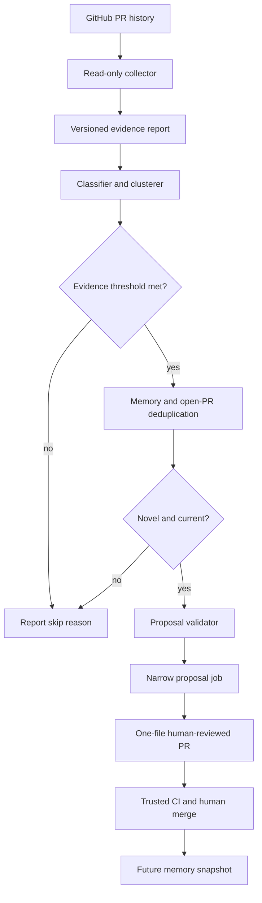
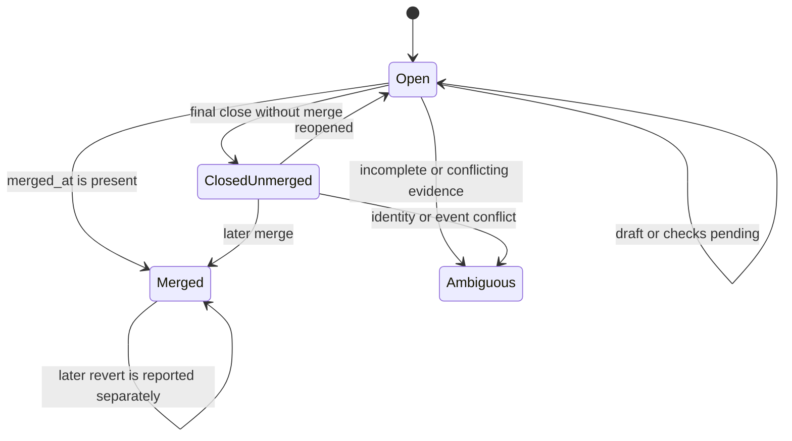

# feat: Add Jules persona PR learning loop

## Summary

Build a repository-scoped, evidence-bound analyzer for Bolt and Sentinel Jules PR outcomes. The analyzer reports merge-rate and problem-family signals, then may open a human-reviewed PR that changes exactly one allowlisted `.jules` memory file. It never edits memory directly, executes PR code, or merges its own proposal.

## Problem Frame

`.jules/bolt.md` and `.jules/sentinel.md` are useful but passive journals. Existing fleet automation tracks sessions, checks, retries, and merges, but it does not distinguish technical lessons from duplicate, stale, unsafe, or policy-failed PRs. Completed persona PRs currently merge at roughly 11.3% for Bolt and 11.9% for Sentinel, measured as `merged / (merged + closed-unmerged)`. The loop should reduce repeated failure families without rewarding PR volume or treating every closed PR as a technical failure.

## Requirements

### Evidence and classification

- R1. Collect only repository-scoped Jules PRs with a mandatory positive identity predicate: stable author identity plus independently verified Jules session/source linkage, exact base/head repository boundaries, and an immutable evaluated head SHA. Missing linkage is `ambiguous`, never an accepted fallback.
- R2. Classify PRs as `merged`, `closed_unmerged`, `open`, or `ambiguous`, using `merged_at` as the merge authority and excluding open, draft, pending, reopened, or incomplete records from terminal counts until their final stable state.
- R3. Assign only the fixed closure taxonomy: `duplicate_or_superseded`, `scope_creep`, `unsupported_claim`, `test_or_policy_failure`, `unsafe_change`, `stale_artifact`, `conflict_or_rebase`, or `unknown`; conflicting or insufficient evidence remains `unknown` and cannot trigger learning.
- R4. Preserve commit-bound provenance for each finding: repository, PR number, base SHA, evaluated head SHA, merge SHA when present, author identity, relevant event/check identifiers, collection timestamp, taxonomy version, and evidence/artifact digests.

### Learning and measurement

- R5. Compute proposal-level merge rate as `merged / (merged + closed_unmerged)` and report separate unique-lesson, aged-open, ambiguous, incomplete, and terminalization views so censoring cannot hide backlog growth.
- R6. Permit one independently verified merged PR to establish a technical lesson and require two distinct PRs in the same semantic cluster for a closed-cause prevention rule.
- R7. Cluster by `persona | mechanism | affected-scope | normalized-rule`, with versioned canonicalization and a stable candidate fingerprint that includes evidence identity and target memory.
- R8. Deduplicate against existing memory, recent memory history, and open or previously closed learning PRs; stale or contradicted evidence is quarantined and reported rather than silently deleted or automatically retracted in the MVP.

### Safe publication

- R9. Generate bounded, scoped memory entries containing a rule, evidence, verification, scope, and retraction condition; do not copy raw PR text, secrets, private session content, exploit payloads, or unsupported quantitative claims.
- R10. Allow proposals to change exactly one ordinary regular file: `.jules/bolt.md` or `.jules/sentinel.md`. Reject additions, deletions, renames, copies, mode changes, symlinks, submodules, path traversal, and all unrelated paths.
- R11. Split read-only collection/classification from proposal creation, use least-privilege credentials, require concurrency and lookup-before-create idempotency, and grant no merge, issue, workflow, or session-mutation permission.
- R12. Require normal trusted CI and human review/merge. Existing fleet auto-merge workflows must not process learning proposals.
- R13. Fail closed on ambiguous identity, missing pages, partial pagination, stale artifacts, API inconsistencies, failed validation, lock/concurrency conflicts, secret-scan findings, and mutation uncertainty.

## Key Technical Decisions

- **Extend the Bun fleet runtime, but isolate the domain:** place GitHub/Jules collection and proposal orchestration with existing `scripts/fleet/**` patterns, while keeping evidence contracts, classification, deduplication, and proposal validation as separate modules. This reuses Octokit, check-state, changed-file, retry, and sanitized-diagnostic patterns without creating a second orchestration runtime.
- **Use a two-job trust boundary:** a read-only collector emits a versioned, digest-bound report artifact; a proposal job accepts only a validated artifact and performs narrowly scoped branch/PR creation. The collector never receives write credentials, checks out PR code, or calls mutation APIs.
- **Treat all GitHub content as hostile data:** titles, bodies, comments, reviews, check names, annotations, and logs are bounded, structured, redacted, and never interpreted as instructions or allowed to select paths, permissions, taxonomy, or approval state.
- **Require verified Jules provenance:** author login alone is insufficient. Eligibility requires immutable author identity, exact base repository, same-repository head, an independently verified Jules session/source record, and matching base/head SHAs. Forks, copied markers, and conflicting identity fields are rejected; historical records without authoritative linkage remain quarantined.
- **Make memory publication append-oriented and content-preserving:** existing entries remain byte-preserved; new entries use stable IDs and bounded structured Markdown. Deduplication updates are proposal decisions, not arbitrary rewrites.
- **Use content-addressed stale-memory protection:** record the target memory blob SHA and base revision used for generation. Regenerate when the target file changes; never auto-resolve a conflict by overwriting newer memory.
- **Make proposal creation idempotent and human-only:** use a versioned candidate fingerprint in the branch/PR marker, workflow concurrency with `cancel-in-progress: false`, and lookup-before-create plus an immediate second check. GitHub-visible markers and base-tree revalidation are the cross-runner concurrency contract; local filesystem locks do not coordinate separate Actions runners. No learning PR may be auto-merged or sent through fleet redispatch.
- **Govern `.jules` as a new sensitive write surface:** add an ADR, explicit matrix row, lock protocol, validator, CODEOWNERS entry, glossary entry, contract tests, ADR index row, and runbook guidance before enabling writes.

## High-Level Technical Design

The following flow is authoritative for boundaries and handoffs:

The proposal artifact should carry: `repo`, `pr_number`, `persona`, `outcome`, `base_sha`, `head_sha`, `merge_sha`, `author_id`, `session_id`, `collector_workflow_run_id`, `collector_commit`, `as_of`, `affected_paths`, `classification`, `taxonomy_version`, `memory_blob_sha`, `candidate_fingerprint`, `classifier_version`, `evidence_digest`, expiry, and the bounded proposed entry. The proposal job must verify the producer workflow, collector revision, repository, base SHA, digest, and expiry before mutation. A missing or contradictory field prevents proposal creation.

Terminal state handling is:

`Ambiguous` is a quarantine state, not a negative outcome. A reopened PR is counted only after its final terminal state passes the configured stabilization cutoff. Reverts remain merged outcomes for the primary metric and are reported separately. A growing aged-open or ambiguous backlog is an operational warning against metric gaming.

## Scope Boundaries

### In scope

- Bolt and Sentinel PR history in `wryenmeek/knowledgebase`.
- Read-only outcome reports, fixed closure classification, semantic clustering, merge-rate metrics, and candidate deduplication.
- Human-reviewed PR proposals changing one of the two existing memory files.
- Governance, validation, permission, workflow exclusion, and regression coverage needed for safe proposal publication.

### Deferred to Follow-Up Work

- Learning for non-Jules authors, other repositories, or other providers.
- Automatic modification of prompts, `.github/agents/**`, workflows, skills, hooks, `AGENTS.md`, or ADRs based on a memory lesson.
- Automatic merge, automatic conflict resolution, or direct edits from scheduled jobs.
- A durable analytics database; the initial report and GitHub PR history remain the source of record.
- Fully automated semantic LLM classification; deterministic structured evidence and bounded human review remain the MVP boundary.

## System-Wide Impact

The feature adds a new path from external GitHub data to repository behavior. `.jules` becomes a sensitive control-adjacent artifact even though it is not an executable file. The workflow must therefore be excluded from fleet merge automation, use explicit permissions, avoid `pull_request_target` checkouts, and preserve the repository’s fail-closed and step-scoped-secret conventions. Metrics must distinguish proposal outcomes from unique lesson outcomes so duplicate or superseded PRs do not create a misleading optimization target.

## Implementation Units

### U1. Define evidence, taxonomy, fingerprint, and memory contracts

- **Goal:** Establish versioned contracts that make collection, classification, deduplication, and proposal validation deterministic.
- **Requirements:** R2, R3, R4, R5, R6, R7, R8, R9, R10, R13.
- **Dependencies:** None.
- **Files:** Create `schema/jules-pr-learning-contract.md`, `schema/jules-memory-entry-contract.md`, `scripts/fleet/pr-learning/types.ts`, `scripts/fleet/pr-learning/fingerprints.ts`, `scripts/fleet/pr-learning/fingerprints.test.ts`, `scripts/fleet/pr-learning/contracts.test.ts`.
- **Approach:** Define the outcome state machine, closure precedence, evidence envelope, taxonomy version, canonical normalization, candidate fingerprint, memory entry shape, proposal marker, size limits, and redaction boundary. Keep `unknown` and incomplete evidence explicit. Include a memory blob SHA and source snapshot digest in every candidate.
- **Patterns to follow:** `scripts/fleet/types.ts`, `scripts/fleet/github/session-matching.ts`, `scripts/fleet/github/ci-checks.ts`, `scripts/fleet/github/pr-file-sanity.ts`, `schema/governed-artifact-contract.md`.
- **Test scenarios:**
  - Valid merged, closed-unmerged, open, and ambiguous envelopes round-trip with required provenance.
  - `merge_commit_sha` without `merged_at` remains closed-unmerged or ambiguous according to the final event evidence, never merged by SHA alone.
  - Reopened, force-pushed, deleted-head, missing-author, forked-head, and conflicting-event fixtures fail closed or remain nonterminal.
  - Equivalent whitespace/order normalization yields one fingerprint; changed taxonomy or canonicalization versions yield distinct fingerprints.
  - Unknown closure causes and missing evidence cannot satisfy the two-observation threshold.
- **Verification:** Contract fixtures define one unambiguous interpretation for every terminal and quarantined state and are consumed by later units without duplicate type definitions.

### U2. Implement read-only collection and evidence classification

- **Goal:** Produce a bounded repository-scoped report from GitHub PR metadata, events, commits, files, reviews, and exact-SHA checks.
- **Requirements:** R1, R2, R3, R4, R5, R13.
- **Dependencies:** U1.
- **Files:** Create `scripts/fleet/pr-learning/collect.ts`, `scripts/fleet/pr-learning/classify.ts`, `scripts/fleet/pr-learning/report.ts`, `scripts/fleet/pr-learning/collect.test.ts`, `scripts/fleet/pr-learning/classify.test.ts`.
- **Approach:** Paginate to exhaustion under a fixed `as_of` timestamp and lookback watermark, record endpoint timestamps/ETags where available, and reconcile mutable fields with a final re-fetch. Validate base/head repository, mandatory author identity and Jules session/source linkage, exact commit SHAs, and trusted checks before classification. Never checkout or execute PR code. On pagination/API failure or cross-endpoint inconsistency, emit an incomplete report and do not advance any watermark.
- **Patterns to follow:** `scripts/fleet/github/session-matching.ts`, `scripts/fleet/github/merge-ci.ts`, `scripts/fleet/github/mutation-diagnostics.ts`, `scripts/maintenance/audit_pr_body_vs_diff.py`, `scripts/validation/check_issue_closure_evidence.py`.
- **Test scenarios:**
  - Both historical Jules login forms are accepted only with repository and session evidence; copied title/body markers and same-owner non-Jules PRs are rejected.
  - Forks, deleted heads, renamed users, null authors, and mismatched base/head SHAs yield no candidate.
  - Pagination, rate-limit, 5xx, timeout, and partial event failures produce bounded diagnostics and no partial advancement.
  - Check conclusions from another SHA or repository do not satisfy verification.
  - Prompt-injection text in titles, bodies, comments, reviews, annotations, and logs is treated as bounded data and never changes paths, permissions, taxonomy, or actions.
- **Verification:** A report can be regenerated from the same GitHub snapshot with the same digest, while incomplete collection is visibly quarantined rather than silently counted.

### U3. Implement clustering, metrics, and candidate eligibility

- **Goal:** Turn classified evidence into per-persona metrics and thresholded, deduplicated candidate proposals without writing repository state.
- **Requirements:** R5, R6, R7, R8, R9.
- **Dependencies:** U1, U2.
- **Files:** Create `scripts/fleet/pr-learning/cluster.ts`, `scripts/fleet/pr-learning/metrics.ts`, `scripts/fleet/pr-learning/deduplicate.ts`, `scripts/fleet/pr-learning/cluster.test.ts`, `scripts/fleet/pr-learning/metrics.test.ts`, `scripts/fleet/pr-learning/deduplicate.test.ts`.
- **Approach:** Group by the semantic key, require one verified merged lesson or two distinct closed causes, and report proposal-level, unique-lesson, aged-open, ambiguous, incomplete, and terminalization metrics. Compare the candidate fingerprint with target memory content, memory history, open learning PR markers, and closed prior proposals. Quarantine later contradictions for human review rather than generating automatic retraction/supersession proposals.
- **Patterns to follow:** `scripts/replay_cache.py`, `tests/kb/test_replay_cache.py`, `scripts/fleet/github/session-matching.ts`, existing duplicate-Jules hygiene in `.github/copilot-instructions.md`.
- **Test scenarios:**
  - One merged Bolt or Sentinel PR yields a technical candidate only when the rule is scoped and evidence-backed.
  - One closed cause does not yield a prevention rule; two distinct PRs in one cluster do.
  - Duplicate memory content, open proposal markers, and previously rejected equivalent candidates produce no second proposal.
  - Reopened PRs are counted once at final terminal state; superseded and duplicate closures are not treated as technical failures.
  - Proposal-level and unique-lesson metrics remain stable under duplicate evidence records.
- **Verification:** Reports expose collected, skipped, ambiguous, classified, duplicate, eligible, and proposal-created counts plus the exact denominator used for each metric.

### U4. Build the memory validator and stale-snapshot guard

- **Goal:** Validate a proposed memory delta before any GitHub mutation and ensure it cannot overwrite newer memory or expand scope.
- **Requirements:** R9, R10, R13.
- **Dependencies:** U1, U3.
- **Files:** Create `scripts/fleet/pr-learning/memory-validator.ts`, `scripts/fleet/pr-learning/proposal-validator.ts`, `tests/fleet/pr-learning/memory-validator.test.ts`, `tests/fleet/pr-learning/proposal-validator.test.ts`.
- **Approach:** Allow only the two enumerated regular files. Verify the target blob SHA at the recorded base, byte-preserve existing content, enforce bounded structured Markdown entries, reject executable expressions/secrets/raw untrusted payloads, and validate the final diff against the recorded base SHA. Reject renames, deletes, additions, copies, modes, symlinks, submodules, extra files, and stale targets.
- **Patterns to follow:** `scripts/kb/write_utils.py`, `scripts/fleet/github/pr-file-sanity.ts`, `scripts/hooks/check_locality_ratchet.py`, `schema/governed-artifact-contract.md`, `scripts/fleet/github/mutation-diagnostics.ts`.
- **Test scenarios:**
  - Valid append-only Bolt and Sentinel entries preserve all existing bytes and satisfy the memory contract.
  - Missing, mismatched, binary, oversized, or stale target blobs fail before mutation.
  - Secret scanner rejects tokens, PEM keys, bearer values, credential URLs, shell fragments, workflow expressions, and prompt-injection instructions in generated memory.
  - Diff validation rejects rename, delete/add, mode, symlink, submodule, unrelated-path, and empty/0-0-0 changes.
  - A target changed after classification causes regeneration/rejection, never overwrite or automatic conflict resolution.
- **Verification:** Proposal validation is a pure decision surface that can prove the exact one-file allowlist and no-write behavior from fixtures.

### U5. Add governed proposal creation with idempotency

- **Goal:** Create one human-reviewed proposal PR only after a validated candidate passes a final live recheck.
- **Requirements:** R8, R10, R11, R12, R13.
- **Dependencies:** U4.
- **Files:** Create `scripts/fleet/pr-learning/propose.ts`, `scripts/fleet/pr-learning/propose.test.ts`, `scripts/fleet/pr-learning/README.md`.
- **Approach:** Use GitHub Git Data/Contents APIs against the validated base SHA to create one blob/tree/commit, then create the branch and PR without checking out or executing PR code. Use a deterministic branch and PR marker containing repository, target memory, candidate fingerprint, and base branch. Run lookup-before-create and an immediate second check under a non-canceling concurrency group, then revalidate the base tree before commit creation. Query after mutation timeouts before retrying. Give the proposal job only the minimum branch/PR creation permissions; GitHub scopes do not provide a distinct “no merge” permission, so human-only merge is enforced by workflow isolation, branch rules, static tests, and explicit exclusion from auto-merge workflows. No issue/session/workflow mutation and no Jules API key unless a separately justified read is required.
- **Patterns to follow:** `scripts/fleet/github/mutation-diagnostics.ts`, `scripts/fleet/github/pr-file-sanity.ts`, `scripts/fleet/github/merge-runtime.ts`, `.github/workflows/jules-archive-stale.yml`, `.github/workflows/fleet-merge.yml`.
- **Test scenarios:**
  - A valid candidate creates one branch and one PR changing only the selected memory file.
  - Concurrent identical runs converge on one proposal; disjoint personas can proceed independently.
  - Timeout after branch or PR creation is recovered by deterministic lookup, not blind mutation retry.
  - Existing open, closed, superseded, and human-edited proposal PRs are handled according to their marker and validation state.
  - Proposal creation never calls merge, auto-merge, issue mutation, label mutation, session mutation, checkout, or command execution on PR code.
- **Verification:** Re-running the same report is idempotent and every mutation path is bounded, sanitized, and observable without exposing evidence content.

### U6. Wire workflows, permissions, and fleet exclusions

- **Goal:** Expose manual/scheduled report and proposal modes with explicit trust boundaries and prevent existing automation from auto-merging learning PRs.
- **Requirements:** R11, R12, R13.
- **Dependencies:** U2, U5.
- **Files:** Create `.github/workflows/jules-persona-learning.yml`, modify `.github/workflows/fleet-merge.yml`, modify `.github/workflows/fleet-dispatch.yml`, create `tests/kb/test_jules_persona_learning_workflow.py`, modify `tests/kb/test_fleet_merge_workflow.py`, modify `tests/kb/test_fleet_dispatch_after_merge.py`.
- **Approach:** Use separate read-only collection and write-capable proposal jobs. Declare exact permissions, authorized manual-run actors, expected workflow revision, and base branch at workflow/job scope; bind any credential at step scope. Use a distinct proposal branch prefix and immutable PR marker rather than requiring label mutation. Require trusted checks on the reviewed SHA and exclude the proposal marker/path from fleet merge and redispatch. MVP mode is report-only/manual proposal creation; scheduled proposal triggers are deferred until manual operation is proven safe.
- **Patterns to follow:** `.github/workflows/ci-2-analyst-diagnostics.yml`, `.github/workflows/jules-account-probe.yml`, `.github/workflows/fleet-dispatch.yml`, `.github/workflows/fleet-merge.yml`, `tests/kb/test_jules_archive_stale_workflow.py`, `tests/kb/test_fleet_dispatch_app_token_diagnostics.py`.
- **Test scenarios:**
  - Static workflow checks reject collector write permissions, proposal merge permissions, App-token minting, issue/workflow/session mutation, `pull_request_target` code checkout, and unscoped secrets.
  - Report-only mode produces an artifact and no branch, PR, comment, label, or memory mutation.
  - Proposal mode requires a validated artifact bound to the collector workflow run, collector commit, exact base SHA, expiry, and human-review path.
  - Fleet merge and dispatch workflows skip learning proposals even when CI passes.
  - New commits invalidate prior approval and stale artifact digests.
- **Verification:** Workflow permissions and trigger paths make the collector read-only, the proposal writer narrowly scoped, and human merge unavoidable.

### U7. Complete governance, documentation, and operational rollout

- **Goal:** Make `.jules` memory changes auditable and maintainable under repository policy.
- **Requirements:** R9, R10, R11, R12, R13.
- **Dependencies:** U1, U4, U6.
- **Files:** Create `docs/decisions/ADR-0XX-jules-persona-memory-learning.md`, modify `AGENTS.md`, modify `CONTEXT.md`, modify `.github/CODEOWNERS`, modify `docs/decisions/README.md`, modify `docs/mvp-runbook.md`, modify `scripts/kb/contracts.py`, modify `tests/kb/test_framework_write_surface_matrix.py`, modify `tests/kb/test_codeowners_completeness.py`, modify `tests/kb/test_doc_cascade_completeness.py`.
- **Approach:** Document memory semantics, provenance, retention/staleness, correction and quarantine, human approval, remote workflow-concurrency publication semantics, write allowlist, hard-fail behavior, permissions, rollback, and observability. Add the `.jules` sensitive-path glossary/CODEOWNERS entry and narrow write-surface row. Do not imply that local ADR-005 filesystem locks coordinate separate GitHub Actions runners; use workflow concurrency plus live base-tree revalidation for remote proposal publication.
- **Patterns to follow:** ADR-005, ADR-019, ADR-022, ADR-028, `AGENTS.md` write-surface matrix, `tests/kb/test_framework_write_surface_matrix.py`, `tests/kb/test_codeowners_completeness.py`, `docs/mvp-runbook.md`.
- **Test scenarios:**
  - Contract tests fail when either memory file, lock, owner, or hard-fail rule is omitted from the declared surface.
  - Documentation cascade tests detect missing ADR index, runbook, CODEOWNERS, glossary, and matrix updates.
  - Lock contention, symlink/path escape, malformed memory, and partial validation produce no write.
  - Rollback guidance covers stale target, closed proposal, invalidated evidence, and accidental proposal-path changes.
- **Verification:** Governance documents, tests, and runtime contracts agree on the same two writable files and no direct/autonomous publication path remains.

## Acceptance Examples

- AE1. Given an open or draft Jules PR with pending checks, when a report is generated, then it appears as nonterminal and does not affect the merge-rate denominator or produce a memory candidate.
- AE2. Given a closed PR with a merge SHA but no `merged_at`, when evidence is classified, then it is not counted as merged.
- AE3. Given one merged performance PR with reproducible behavior-preservation evidence, when clustering runs, then one scoped Bolt technical lesson may be proposed.
- AE4. Given two distinct closed PRs with the same verified actionable scope cause, when clustering runs, then one prevention-rule candidate may be proposed; one such closure alone cannot.
- AE5. Given a candidate whose target memory blob changed after classification, when proposal validation runs, then it rejects or regenerates without overwriting the newer file.
- AE6. Given a valid candidate and a malicious second-path diff, when the proposal validator runs, then it rejects the entire proposal.
- AE7. Given two concurrent runs for the same candidate fingerprint, when proposal creation runs, then at most one learning PR exists.
- AE8. Given a valid learning PR with passing CI, when fleet merge automation runs, then it does not merge the PR; branch protection and required human approval must still be satisfied before a human merges it.

## Risks & Dependencies

- **GitHub API drift or rate limits:** Use bounded retries for retryable failures, preserve a fixed `as_of` snapshot, and quarantine incomplete reports without advancing watermarks.
- **Identity ambiguity:** Exact structured identity and session/source checks are prerequisites; title, branch, body, and labels are never sufficient.
- **Prompt injection and secret leakage:** Treat all external text as hostile data, bound fields, redact before prompts/logs/artifacts, and never execute collected code.
- **Duplicate or stale proposals:** Versioned fingerprints, non-canceling concurrency, deterministic markers, lookup-before-create, and memory blob checks prevent duplicate or overwriting writes.
- **Metric gaming:** Report proposal-level and unique-lesson metrics, exclude unknown/incomplete states, and do not optimize for PR volume.
- **Governance drift:** Contract tests and documentation cascade tests must land with the new writer; no proposal workflow is enabled before they pass.
- **Runtime dependency:** Bun, Octokit, GitHub Actions permissions, and repository branch protection remain required. Exact Jules session linkage API fields and the final available GitHub App identity are implementation-time validation points.

## Documentation / Operational Notes

Start in report-only/manual mode and retain structured artifacts for operator review. The run summary should expose counts and sanitized rejection reasons, not raw PR content or memory text. Proposal PRs need a distinct label and branch prefix so operators can find them and existing fleet workflows can exclude them. A rejected or closed proposal remains linked to its candidate fingerprint; reconsideration requires fresh evidence or an explicit human correction. A later contradiction is represented by a new supersession/retraction proposal.

## Sources / Research

- `.jules/bolt.md` and `.jules/sentinel.md` establish the current passive memory format and existing lesson themes.
- `scripts/fleet/fleet-plan.ts`, `scripts/fleet/fleet-dispatch.ts`, `scripts/fleet/fleet-merge.ts`, `scripts/fleet/github/session-matching.ts`, `scripts/fleet/github/ci-checks.ts`, `scripts/fleet/github/merge-ci.ts`, `scripts/fleet/github/pr-file-sanity.ts`, and `scripts/fleet/github/mutation-diagnostics.ts` provide fleet orchestration, identity, check, diff, retry, and diagnostic patterns.
- `docs/decisions/ADR-005-write-concurrency-guards.md`, `ADR-019-fleet-jules-orchestration.md`, `ADR-022-afk-uses-scripts-hitl-uses-copilot-cli.md`, `ADR-028-instruction-locality-ladder.md`, and `ADR-036-fleet-orchestrator-github-app-identity.md` constrain locks, trust boundaries, human review, and credentials.
- `scripts/maintenance/audit_pr_body_vs_diff.py`, `scripts/validation/check_issue_closure_evidence.py`, `scripts/hooks/check_test_framework.py`, and their tests demonstrate diff verification, evidence requirements, and strict policy ratchets.
- `AGENTS.md`, `CONTEXT.md`, `.github/CODEOWNERS`, and `tests/kb/test_framework_write_surface_matrix.py` define the required governance and documentation cascades for a new write surface.
- The supplied Jules persona history research report provides the evidence thresholds, taxonomy, clustering key, metric, and PR-only boundary carried into this plan.
