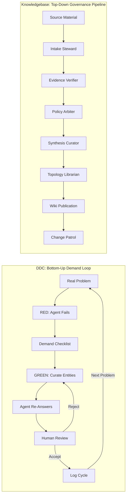

# DDC vs Knowledgebase: Comparative Analysis

> ⚠️ **Review note (2026-05-13):** The AFK adoption recommendations in §Recommendations are blocked by [ADR-014](../decisions/ADR-014-hitl-afk-work-classification.md). LLM-driven wiki updates do not qualify for the AFK allowlist (which permits only deterministic, bounded writes). The adversarial review is at [DDC Adversarial Review](./ddc-adversarial-review.md). Per ADR-014, treat recommendations requiring LLM judgment as HITL tasks.

## Executive Summary

DDC (Demand-Driven Context) and the `wryenmeek/knowledgebase` repo share a fundamental conviction—**curated, structured knowledge stored in-repo dramatically outperforms retrieval-augmented generation over raw documentation**—but they attack the problem from opposite ends. DDC is a **bottom-up methodology** that grows knowledge iteratively by forcing AI agents to fail on real problems and then curating only the minimum context needed to succeed. The knowledgebase is a **top-down governance framework** that controls how knowledge is ingested, validated, cited, published, and maintained through deterministic policy gates. DDC prioritizes *demand discovery* and *convergence measurement*; the knowledgebase prioritizes *provenance integrity* and *write-path safety*. The two approaches are deeply complementary: DDC's demand-driven curation methodology could feed the knowledgebase's governed publication pipeline, and the knowledgebase's quality and freshness tooling could close gaps DDC currently leaves open.

---

## Table of Contents

1. [Architecture Comparison](#1-architecture-comparison)
2. [Knowledge Representation](#2-knowledge-representation)
3. [Knowledge Acquisition Methodology](#3-knowledge-acquisition-methodology)
4. [Agent and Skill Frameworks](#4-agent-and-skill-frameworks)
5. [Quality Assurance and Validation](#5-quality-assurance-and-validation)
6. [Tooling and Visualization](#6-tooling-and-visualization)
7. [Complementary Approaches](#7-where-approaches-complement-each-other)
8. [Conflicting Approaches](#8-where-approaches-conflict)
9. [Patterns Worth Adopting or Adapting](#9-patterns-worth-adopting-or-adapting-from-ddc)
10. [Key Repositories](#10-key-repositories)
11. [Confidence Assessment](#11-confidence-assessment)

---

## 1. Architecture Comparison



### DDC Architecture

DDC is a **monorepo methodology toolkit** organized around the iterative "fail-then-curate" loop[^1]. Its architecture is deliberately lightweight:

| Component | Purpose |
|-----------|---------|
| `domain-knowledge/entities/` | Typed entity files organized by EA interrogative[^2] |
| `ddc-cycle-logs/` | Structured audit trail of each cycle's RED/GREEN phases[^3] |
| `meta/` | Entity type and relationship type schemas in YAML[^4] |
| `.claude/agents/` | 5 specialist sub-agents (TA, PO, SE, DA, SA)[^5] |
| `.claude/skills/` | 4 slash commands driving the DDC workflow[^6] |
| `tooling/` | FastAPI + React knowledge base viewer[^7] |
| `tools/context-gap-scanner/` | Firebase-hosted automated gap analysis[^8] |

### Knowledgebase Architecture

The knowledgebase is a **policy-governed, self-organizing knowledge repository** with six CI lanes, 22 ADRs, dual-layer concurrency guards, and a deny-by-default write-surface matrix[^9]:

| Component | Purpose |
|-----------|---------|
| `wiki/` | Curated knowledge pages with strict namespaces[^10] |
| `raw/inbox/` → `raw/processed/` | Untrusted-to-immutable ingest pipeline[^11] |
| `schema/` | 12 contract files governing every write operation[^12] |
| `scripts/kb/` | Deterministic Python execution surface[^13] |
| `.github/agents/` | 17 agent personas in a strict orchestration pipeline[^14] |
| `.github/skills/` | 102 skills (as of 2026-05)[^15] |
| `docs/decisions/` | 21 Architecture Decision Records, all Accepted[^16] |

### Key Architectural Differences

| Dimension | DDC | Knowledgebase |
|-----------|-----|---------------|
| **Philosophy** | "Fail first, curate minimum" | "Fail closed, prove before write" |
| **Growth model** | Bottom-up, problem-driven | Top-down, source-driven |
| **Trust model** | Human domain expert in the loop | Policy-gated automation pipeline |
| **Write controls** | Git branching only | Dual-layer locks + write-surface matrix |
| **CI/CD** | None[^17] | 6 CI lanes with scoped permissions[^18] |
| **Testing** | Methodology-level (cycle logs as tests)[^19] | Comprehensive pytest suite + pre-commit hooks[^20] |

---

## 2. Knowledge Representation

### Entity Format Comparison

Both repos use **Markdown with YAML frontmatter** as the knowledge unit, but with significantly different schemas.

#### DDC Entity Format[^21]

```yaml
---
type: system
id: claims-gateway
name: Claims Gateway
description: Ingestion point for all incoming claims
status: active              # active | deprecated | planned
related_systems: [rules-engine, eligibility-service]
implements_capability: claims-processing
depends_on: [pre-auth-service]
owned_by: claims-team
---

# Claims Gateway
## Overview
<2-3 sentence description>
## Details
<up to ~150 lines>
```

#### Knowledgebase Page Format[^22]

```yaml
---
type: entity              # entity | concept | source | analysis | process
title: "<canonical-title>"
status: active            # active | superseded | archived
sources:
  - repo://<owner>/<repo>/<path>@<git_sha>#<anchor>?sha256=<64-hex>
open_questions:
  - "<question requiring arbitration>"
confidence: 1             # integer 1..5
sensitivity: public       # public | internal | restricted
updated_at: "YYYY-MM-DDTHH:MM:SSZ"
tags:
  - "<normalized-tag>"
---

# <canonical-title>
## Summary
## Evidence
## Open Questions
```

### Type System Comparison

| Aspect | DDC | Knowledgebase |
|--------|-----|---------------|
| **Entity types** | 17 typed by EA interrogative (What/Why/Who/How/With/Context)[^23] | 5 page types (entity/concept/source/analysis/process)[^10] |
| **Relationships** | 14 typed verbs (owns, implements, depends_on, etc.) as frontmatter fields[^24] | 8 controlled vocabulary relations in optional body section[^25] |
| **Identity** | `id` field (kebab-case, matches filename)[^21] | Canonical title + optional `entity_id` + slug[^26] |
| **Provenance** | None — no citation format | Commit-bound SourceRef with SHA-256[^27] |
| **Confidence** | Per-cycle confidence (1-5 scale in cycle logs)[^28] | Per-page confidence (1-5 scale in frontmatter)[^22] |
| **Classification** | Flat directory hierarchy by entity type[^2] | Flat namespace hierarchy by page type[^10] |

### Key Differences

DDC's type system is **domain-centric**: 17 types modeled after enterprise architecture interrogatives (offering, capability, team, persona, system, API, data-model, etc.)[^23]. Each type has optional custom fields (e.g., `make_or_buy` for systems, `event_type` for business-events)[^23]. Relationships are encoded as frontmatter fields with direct entity ID references[^24].

The knowledgebase's type system is **epistemological**: 5 types distinguish what *kind of knowledge* the page represents (entity = durable subject, concept = abstract topic, source = evidence record, analysis = synthesis output, process = operational artifact)[^10]. The focus is on *knowledge provenance* rather than *domain modeling*.

---

## 3. Knowledge Acquisition Methodology

### DDC: The Demand-Driven Cycle[^29]

DDC's core innovation is treating knowledge curation like TDD:

| TDD | DDC |
|-----|-----|
| Write a failing test | Give agent a failing problem |
| Write minimum code to pass | Curate minimum context to succeed |
| Test passes | Agent produces correct output |
| Refactor | Validate and tighten entity definitions |
| Next test | Next problem |

**The 6-Step DDC Cycle:**[^30]

1. **Take a Representative Problem** — a real production incident, architecture question, or design task
2. **RED Phase** — agent searches existing KB, attempts answer with only existing context, produces a **Demand Checklist** rating confidence 1-5 per gap category
3. **GREEN Phase** — domain expert provides missing info, agent curates typed entity files with correct placement and wired relationships
4. **Answer the Problem (AFTER)** — agent re-reads all context and re-answers with specific names, traced flows, concrete recommendations
5. **Human Review** — expert validates; rejections are logged and iterated
6. **Log the Cycle** — structured log capturing before/after quality, entities created/reused, time spent

**The Convergence Hypothesis:**[^31] After 20-30 representative problems, knowledge coverage converges for a given role. Each new problem requires fewer new entities (shorter Demand Checklist). Empirically validated: 24 DDC-curated entities outperformed RAG over 127 documentation pages (4.49 vs 3.20, Cohen's d = 1.84, p < 0.001)[^32].

### Knowledgebase: The Governed Ingest Pipeline[^33]

The knowledgebase follows a **sequential governance pipeline** for all new knowledge:

1. **Source Intake** — material enters `raw/inbox/`, validated by source-intake-steward
2. **Evidence Verification** — checksum, SourceRef, claim inventory, AI-tells detection
3. **Policy Arbitration** — NPOV, original-research check, schema compliance
4. **Synthesis** — entity-resolution, page drafting with template enforcement
5. **Topology** — link structure, index update, backlink suggestions
6. **Publication** — governed write under lock, log append, change-patrol review

**Key difference:** DDC generates demand *from agent failure on real problems*. The knowledgebase accepts source material *from any external origin* and governs its path to publication. DDC asks "what's missing?" The knowledgebase asks "is this trustworthy?"

### Coverage Gap Detection

Both repos have mechanisms for detecting knowledge gaps, but implemented very differently:

| Aspect | DDC | Knowledgebase |
|--------|-----|---------------|
| **Gap detection** | RED phase demand checklist + Context Gap Scanner[^34] | `analyze-missed-queries` skill scanning wiki pages[^35] |
| **Signal source** | Agent failure on real problems | Citation gaps, placeholder text, low confidence markers |
| **Scoring** | 6 category scores (0-100) with tribal knowledge at 2x weight[^36] | Priority score (unbounded integer) with 6 weighted signals[^37] |
| **Automation** | Firebase-hosted 3-stage Claude pipeline[^8] | Python script + SKILL.md contract[^35] |
| **Human input** | Domain expert provides answers directly | Human steward approves policy decisions |

---

## 4. Agent and Skill Frameworks

### DDC Agent Architecture[^5]

DDC uses **5 domain-role agents** modeling enterprise architect roles:

| Agent | Role | Navigation Pattern |
|-------|------|-------------------|
| `ta-agent` | Technology Architect | systems → sequences → decisions |
| `po-agent` | Product Owner | requirements, journey mapping |
| `se-agent` | Senior Engineer | code review, solution design |
| `da-agent` | Data Architect | data-models, data-products |
| `sa-agent` | Security Architect | security review, compliance |

Each agent is a simple markdown file with YAML frontmatter specifying `name`, `description`, `tools`, and `model`[^38]. The agents are **advisory**: they help reason about the domain but don't participate in a governance pipeline.

DDC uses **4 slash-command skills**[^6]:

| Skill | Command | Purpose |
|-------|---------|---------|
| `ddc-cycle` | `/ddc-cycle` | Full 6-step DDC loop with git branching |
| `ddc-status` | `/ddc-status` | Entity counts, coverage, recent changes |
| `ddc-entity` | `/ddc-entity` | Single entity management |
| `ddc-demo` | `/ddc-demo` | Demo walkthrough |

### Knowledgebase Agent Architecture[^14]

The knowledgebase uses **17 agent personas** in a strict orchestration pipeline with two categories:

**KB-Workflow Agents (pipeline governance):**
- `knowledgebase-orchestrator` — entry gate, routes to lanes
- `source-intake-steward` — trust boundary guardian
- `evidence-verifier` — provenance completeness checker
- `policy-arbiter` — editorial constitution enforcer
- `synthesis-curator` — page drafter
- `query-synthesist` — wiki-first question answerer
- `topology-librarian` — link structure maintainer
- `entity-resolution-and-canonicalization` — identity arbiter
- `maintenance-auditor` — staleness and orphan detector
- `change-patrol` — diff-based risk classifier
- `quality-analyst` — quality signal aggregator

**Dev-Support Agents (advisory):**
- `code-reviewer`, `test-engineer`, `security-auditor`, `documentation-engineer`, `solutions-architect`, `framework-engineer`

The knowledgebase uses **102 skills** (as of 2026-05)[^15], with each skill defined by a `SKILL.md` procedural contract. Skills are classified as Direct (operator-safe), Persona (pipeline-only), or Both.

### Key Differences

| Dimension | DDC | Knowledgebase |
|-----------|-----|---------------|
| **Agent count** | 5 domain advisors | 17 governance + advisory |
| **Skill count** | 4 slash commands | 85+ workflow skills *(Note: actual count as of 2026-05: 102 skills)* |
| **Orchestration** | Flat (user invokes directly) | Hierarchical pipeline (orchestrator routes) |
| **Agent purpose** | Domain expertise simulation | Governance enforcement |
| **Enforcement** | Formatting rules (`.claude/rules/`)[^39] | Write-surface matrix + contract tests[^40] |
| **Agent framework** | Claude Code `.claude/` convention | VS Code Copilot `.github/` convention |

---

## 5. Quality Assurance and Validation

### DDC Quality Model[^28]

DDC's quality assurance is **methodology-level**, embedded in the cycle:

- **Before/after confidence scores** (1-5) in each cycle log
- **Human review scores** (1-5) with mandatory rejection logging
- **Convergence analysis** via `coverage-curve.py` — tracks entities created per cycle, showing diminishing returns as knowledge converges[^41]
- **Entity reuse tracking** — cycle logs record which prior entities were reused[^42]
- **No conventional test suite** — no `pytest`, no CI, no automated linting[^19]
- **Format enforcement** via Claude rules files: `entity-format.md`, `cycle-log-format.md`, `anonymization.md`[^39]

### Knowledgebase Quality Model[^37]

The knowledgebase has a **multi-layered, automated quality pipeline**:

| Layer | Tool | What It Checks |
|-------|------|----------------|
| Pre-commit hooks | `check_frontmatter.py` etc. | Frontmatter fields, lock files, SourceRef format[^20] |
| Structural linting | `lint_wiki.py` | 10 violation codes (missing sections, orphans, broken links)[^43] |
| Freshness audit | `check_doc_freshness.py` | Age-based staleness (90-day quarterly cadence)[^44] |
| Coverage gaps | `analyze_missed_queries.py` | 6 gap patterns (missing citations, placeholders, empty sources)[^35] |
| Quality scoring | `quality_runtime.py` | Composite priority score from 6 weighted signals[^37] |
| Content reports | `content_quality_report.py` | Persisted JSON quality artifacts[^45] |
| Framework tests | `test_framework_*.py` | Contract alignment, write-surface matrix coverage[^20] |
| Change patrol | `change-patrol` agent | Post-publication diff-based risk classification[^46] |

### Quality Gap Analysis

| Quality Dimension | DDC Coverage | KB Coverage |
|-------------------|-------------|-------------|
| Content accuracy | Human review (1-5 scores) | Evidence verification + NPOV enforcement |
| Format compliance | Claude rules enforcement | Pre-commit hooks + deterministic linting |
| Freshness | Not addressed | 90-day threshold + automated sweep |
| Citation integrity | Not addressed | Commit-bound SourceRef validation |
| Coverage gaps | Context Gap Scanner + RED phase | Missed-query analysis + quality scoring |
| Convergence metrics | Coverage-curve analysis | Not addressed |
| Write safety | Git branching only | Dual-layer locks + write-surface matrix |
| Reuse tracking | Cycle log notes | Not addressed at page level |
| AI-tells detection | Not addressed | `detect-ai-tells` skill |
| Original research check | Not addressed | `detect-original-research` skill |

---

## 6. Tooling and Visualization

### DDC Tooling[^7]

DDC provides a **web-based knowledge explorer** with rich visualization:

- **FastAPI backend** parsing `domain-knowledge/` into an in-memory entity index at startup
- **React/TypeScript frontend** with 7 view modes: list, graph, BPMN, Mermaid, SVG, glossary, learning-path
- **Cytoscape.js interactive graph** with BFS subgraph algorithm (configurable depth, default 2)[^47]
- **Weighted text search** (name: 1.0, description: 0.5, content: 0.2)[^48]
- **Context Gap Scanner** — Firebase-hosted AI-powered domain gap analysis tool[^8]
- **Coverage curve analysis** — Python script visualizing convergence patterns[^41]

### Knowledgebase Tooling

The knowledgebase has **command-line deterministic tooling** without a web UI:

- **`scripts/kb/`** — Python CLI tools (ingest, index, lint, preflight, persist-query)
- **`scripts/reporting/`** — Quality scoring and content reports persisted as JSON
- **`scripts/validation/`** — Freshness, AFK output validation
- **`scripts/github_monitor/`** — GitHub source drift detection pipeline
- **`scripts/drive_monitor/`** — Google Drive source drift detection pipeline
- **`wiki/index.md`** — Deterministic discovery index (generated artifact)

### Visualization Gap

DDC has **significantly richer visualization** capabilities. The knowledge graph viewer with Cytoscape.js, BPMN diagram rendering, and learning-path generation are features the knowledgebase entirely lacks. The knowledgebase's `wiki/index.md` is a flat text listing — it has no graph visualization, no interactive exploration, and no diagram rendering.

---

## 7. Where Approaches Complement Each Other

### 7.1 DDC's Demand Discovery → KB's Governed Publication

DDC excels at **discovering what knowledge is needed** through its RED-phase demand checklists. The knowledgebase excels at **governing how that knowledge enters the wiki**. A combined workflow would be:

1. DDC cycle identifies gaps via RED phase demand checklist
2. Domain expert provides answers (DDC GREEN phase)
3. Curated entities enter `raw/inbox/` as source material
4. Knowledgebase ingest pipeline verifies provenance, applies NPOV, resolves identity
5. Governed publication ensures traceability and citation integrity

This would give DDC's practical, problem-driven content the knowledgebase's provenance guarantees.

### 7.2 DDC's Convergence Metrics → KB's Quality Pipeline

DDC measures **knowledge convergence** — how quickly new problems stop requiring new entities[^31]. The knowledgebase measures **knowledge quality** — freshness, citation coverage, structural completeness[^37]. These are complementary signals:

- DDC convergence tells you *when you've curated enough*
- KB quality metrics tell you *whether what you've curated is well-maintained*
- Together: converged AND high-quality = done; converged BUT degrading quality = maintenance needed

### 7.3 DDC's Entity Type System → KB's Ontology Layer

DDC's 17-type EA meta-model[^23] provides a **domain modeling vocabulary** the knowledgebase currently lacks. The knowledgebase's `ontology-entity-contract.md` defines merge/split/alias rules but not domain-specific entity typing[^25]. DDC's typed entities could inform the knowledgebase's tag and browse-path taxonomy.

### 7.4 DDC's Visualization → KB's Discovery

DDC's interactive knowledge graph, learning paths, and diagram rendering[^7] could dramatically improve the knowledgebase's discoverability, which currently relies on flat-file indexes and tag-based search.

### 7.5 KB's Source Monitoring → DDC's Freshness

The knowledgebase's GitHub and Google Drive source monitoring pipelines (ADR-012, ADR-021)[^49] detect when upstream sources drift from what the wiki describes. DDC has no equivalent — entities can go stale without detection. The knowledgebase's 90-day freshness threshold and automated sweep[^44] would keep DDC entities current.

### 7.6 KB's Rejection Registry → DDC's Curation Discipline

The knowledgebase's write-once rejection registry[^50] records *why* sources were rejected, preventing silent re-submission. DDC logs rejected cycle *attempts* but doesn't prevent re-processing the same bad source material. The rejection registry pattern would strengthen DDC's curation discipline.

### 7.7 KB's HITL/AFK Classification → DDC's Automation Boundary

The knowledgebase's ADR-014 deny-by-default HITL classification[^51] provides a rigorous framework for deciding what can be automated and what requires human judgment. DDC currently assumes human-in-the-loop for everything but could benefit from classifying which entity updates are safe for automated maintenance.

---

## 8. Where Approaches Conflict

### 8.1 Bottom-Up vs Top-Down Knowledge Growth

**DDC:** Knowledge grows from agent failure. You don't plan what to curate — problems tell you. The methodology explicitly rejects top-down documentation approaches: "Stop trying to document everything."[^1]

**Knowledgebase:** Knowledge enters through governed source intake. Source material is validated before it reaches the wiki. The architecture implicitly assumes sources arrive from external origins.

**Tension:** DDC's demand-driven approach may produce entities that lack the provenance chain the knowledgebase requires. A DDC entity created from "direct human answers" during the GREEN phase has no `raw/inbox/` artifact, no SourceRef, no sha256 checksum.

### 8.2 One Concept Per File vs Page-Level Composition

**DDC:** Strict "one concept per file" discipline with a ~150-line soft cap[^21]. Entities are small, atomic, and typed. An API entity and its owning system entity are separate files even if tightly coupled.

**Knowledgebase:** Pages are larger compositional units. A wiki page about an entity includes Summary, Evidence, Open Questions, Aliases, and Relationships sections[^22]. Evidence from multiple sources is composed into a single page.

**Tension:** DDC's granularity is finer. A DDC knowledge base with 40 entity files might map to 15-20 knowledgebase wiki pages, requiring composition logic that neither system currently provides.

### 8.3 Flexible Relationships vs Controlled Vocabulary

**DDC:** 14 typed relationship verbs encoded as frontmatter fields with direct ID references[^24]. New relationship fields can be added freely. Relationships are part of the entity data model.

**Knowledgebase:** 8 controlled-vocabulary relations documented in an optional body section[^25]. Relations are governed by the ontology-entity-contract and must use the "narrowest valid relation." New relation types require schema evolution through ADR.

**Tension:** DDC's domain-specific relationship fields (e.g., `implements_capability`, `owned_by`) are richer for domain modeling but would violate the knowledgebase's controlled vocabulary constraint.

### 8.4 No CI vs Six CI Lanes

**DDC:** No automated testing, no CI workflows, no linting pipelines[^17]. Quality is enforced through methodology (human review) and Claude rules.

**Knowledgebase:** Six CI lanes with scoped permissions, pre-commit hooks, contract tests, and automated freshness sweeps[^18]. Quality is enforced through deterministic tooling.

**Tension:** DDC's lightweight approach allows fast iteration but provides no automated safety net. The knowledgebase's heavy governance provides safety but can slow iteration. Merging the approaches requires deciding which DDC operations need governance and which can remain lightweight.

### 8.5 Agent Failure as Signal vs Agent Failure as Error

**DDC:** Agent failure is the *desired initial state*. The RED phase deliberately produces a failing answer to expose gaps[^29]. Failure is productive.

**Knowledgebase:** Agent failure triggers fail-closed behavior. Missing prerequisites, lock contention, and validation errors all halt the pipeline[^9]. Failure is protective.

**Tension:** Both are correct in their context. DDC's "failure as signal" applies to *knowledge discovery*. The knowledgebase's "failure as error" applies to *knowledge publication*. A merged system would need to clearly distinguish the discovery phase (where failure is welcome) from the publication phase (where failure must halt).

---

## 9. Patterns Worth Adopting or Adapting from DDC

### 9.1 🔴 The RED/GREEN Demand-Driven Curation Cycle

**What:** DDC's TDD-for-knowledge methodology — give the agent a real problem, let it fail, curate only the minimum needed context, re-test, iterate[^29].

**Why adopt:** The knowledgebase currently has no systematic methodology for deciding *what* to curate. Source material arrives and enters the ingest pipeline, but there's no mechanism for identifying what's *missing*. DDC's RED phase demand checklists would generate prioritized curation targets.

**How to adapt:** Create a new `ddc-cycle` skill in `.github/skills/` that:
1. Takes a domain question as input
2. Attempts to answer using only existing `wiki/` content (RED phase)
3. Produces a structured demand checklist of missing entities/concepts
4. Routes identified gaps as curation backlog items through `knowledgebase-orchestrator`

This would be read-only and could be classified AFK under ADR-014 since it produces recommendations, not writes.

### 9.2 📊 Convergence Measurement

**What:** DDC tracks entities created per cycle and measures convergence — the declining rate of new entity creation as knowledge saturates for a role[^31][^41].

**Why adopt:** The knowledgebase has quality metrics (freshness, citation coverage, placeholder count) but no *completeness* metric. You can tell if existing pages are high-quality but not whether important topics are missing.

**How to adapt:** Add convergence tracking to the quality reporting pipeline:
- Track "new page creation rate" over time windows
- Track "demand checklist size" per curation cycle (if RED/GREEN is adopted)
- Add a `coverage_signal` dimension to `quality_runtime.py` scoring

### 9.3 🏗️ Enterprise Architecture Entity Type Meta-Model

**What:** DDC's 17 entity types organized by EA interrogative (What/Why/Who/How/With/Context) with typed custom fields and a formal meta-model YAML[^23].

**Why adopt:** The knowledgebase's 5 page types (`entity|concept|source|analysis|process`) are epistemological but don't provide domain-modeling vocabulary. For enterprise knowledge bases specifically, DDC's type system enables richer querying ("show me all systems owned by team X that depend on API Y").

**How to adapt:** Rather than replacing the knowledgebase's page types, encode DDC's entity types as **tag vocabulary** or **browse-path categories**:
- A `wiki/entities/claims-gateway.md` page could have `tags: [system, make-or-buy-make, claims-team]`
- Browse path: `["systems", "claims-processing"]`
- This preserves the KB's epistemological type system while adding DDC's domain vocabulary

Alternatively, add an optional `domain_type` frontmatter field governed by a new schema contract.

### 9.4 🔍 Context Gap Scanner (AI-Powered Gap Analysis)

**What:** DDC's Firebase-hosted 3-stage Claude pipeline that generates domain-specific probes, executes them against available context, and produces scored gap analysis with prioritized curation checklists[^8][^34].

**Why adopt:** The knowledgebase's `analyze-missed-queries` skill scans for structural gaps (missing citations, placeholders) but doesn't test whether the wiki can actually *answer domain questions*. DDC's gap scanner tests functional knowledge coverage.

**How to adapt:** Create a `context-gap-scanner` skill that:
1. **Generate probes** — given a wiki namespace or topic area, generate 6 domain-specific questions across DDC's probe categories (INCIDENT, INTEGRATION, DATA_FLOW, TERMINOLOGY, PROCESS, ARCHITECTURE)
2. **Execute probes** — attempt to answer each probe using only existing wiki content (similar to `retrieve-from-index` → `synthesize-cited-answer`)
3. **Analyze gaps** — score coverage per entity-type category (0-100), produce prioritized gap list

The key adaptation: DDC's scanner asks "what would an agent get wrong?" while the KB's existing tools ask "what's structurally incomplete?" Combining both gives much richer coverage assessment.

### 9.5 📈 Cycle Log Structured Audit Trail

**What:** DDC's cycle logs capture before/after agent answers, demand checklists, entities curated, human review scores, rejection iterations, and reuse notes in a structured format[^3][^28].

**Why adopt:** The knowledgebase's `wiki/log.md` is an append-only state-change trail — it records *what happened* but not *why it was needed* or *how it improved quality*. DDC's cycle logs provide a richer audit trail connecting problems to curation decisions.

**How to adapt:** Extend the knowledgebase's log schema to optionally capture:
- The triggering question or problem
- Before/after quality assessment
- Which pages were created/updated as a result
- Human review outcome
- Entity reuse from prior cycles

This could be a new `wiki/curation-logs/` namespace with its own page type.

### 9.6 🌐 Interactive Knowledge Graph Visualization

**What:** DDC's Cytoscape.js-powered interactive graph with BFS subgraph exploration, 7 view modes, and entity-to-diagram linkage[^7][^47].

**Why adopt:** The knowledgebase has no visualization. Discovery relies on `wiki/index.md` (a flat text listing) and tag-based search. An interactive graph would dramatically improve knowledge discoverability and relationship exploration.

**How to adapt:** This is a significant engineering effort but could start with:
1. A read-only API that parses wiki frontmatter into graph nodes/edges (similar to DDC's `graph_builder.py`)
2. A static site generator that produces a Cytoscape.js visualization from `wiki/index.md`
3. Integration with the existing `suggest-backlinks` and `cross-reference-symmetry-check` skills

### 9.7 🎯 "Prove, Then Scale" Principle

**What:** DDC's principle of getting one problem type working before expanding[^1]. Start with SRE incidents (clear success criteria, fast cycles), then expand to architecture reasoning, then design tasks.

**Why adopt:** The knowledgebase's governance framework is comprehensive but can feel heavyweight for initial knowledge seeding. Adopting DDC's "prove then scale" approach for new knowledge domains would reduce the barrier to getting started.

**How to adapt:** Create a "lightweight bootstrap" lane in `knowledgebase-orchestrator` that:
- Allows faster entity creation during initial domain seeding
- Enforces basic format compliance but defers full evidence verification
- Transitions to full governance once convergence metrics indicate the domain is maturing

### 9.8 🗺️ Learning Path Generation

**What:** DDC's tooling viewer can generate **learning paths** from the most-referenced entities[^7]. These emerge naturally from the knowledge graph topology — entities referenced by many cycles form the foundational concepts.

**Why adopt:** The knowledgebase has no onboarding or learning path features. New readers face a flat index of all pages with no suggested reading order.

**How to adapt:** Add a `learning-path` report type to `scripts/reporting/` that:
- Analyzes cross-reference frequency in `wiki/` pages
- Identifies foundational entities (referenced by many pages)
- Generates a suggested reading order from foundations to specialized topics
- Persists as a governed report artifact

### 9.9 🔐 Anonymization Protocol for Proprietary Domains

**What:** DDC uses a `.private/anonymization-map.yaml` file to replace proprietary names with fictional equivalents (e.g., real company names → "RetailCo")[^52]. The `/ddc-cycle` skill checks for this map at Step 0 and enforces naming substitution before any entity is written.

**Why adapt:** If the knowledgebase is used for enterprise contexts where source material contains proprietary information, an anonymization layer would enable sharing curated knowledge without exposing internal details. This pattern could also support the `sensitivity: restricted` frontmatter field.

---

## 10. Key Repositories

| Repository | URL | Purpose |
|-----------|-----|---------|
| `ea-toolkit/ddc` | [github.com/ea-toolkit/ddc](https://github.com/ea-toolkit/ddc) | DDC methodology, toolkit, templates, examples, tooling viewer, and context gap scanner |
| `wryenmeek/knowledgebase` | [github.com/wryenmeek/knowledgebase](https://github.com/wryenmeek/knowledgebase) | Governed knowledge repository with agent/skill framework, deterministic ingest pipeline, and quality reporting |

---

## 11. Confidence Assessment

### High Confidence (verified against source code and documentation)
- Both repos' entity/page format schemas — fetched and compared at field level
- DDC's 6-step cycle methodology — verified from METHODOLOGY.md, SKILL.md, and example cycle logs
- Knowledgebase's governance pipeline — verified from AGENTS.md, schema contracts, and contracts.py
- DDC's Context Gap Scanner — complete system prompts and scoring algorithm fetched
- Knowledgebase's quality scoring — complete formula and signal weights verified from source

### Medium Confidence (verified from documentation, not all code paths)
- DDC convergence hypothesis empirical validation — stats cited from README, paper not reviewed
- Knowledgebase's CI-4/CI-5/CI-6 pipeline behavior — inferred from ADRs and workflow descriptions
- Integration patterns between the two approaches — based on architectural analysis, not implementation

### Lower Confidence (inferred or partially verified)
- DDC's RetailCo domain — directory structure seen but active cycle logs not read
- Knowledgebase's fleet orchestration (Jules/TypeScript) — referenced in ADR-019 but not investigated
- Specific adaptation effort estimates — these are architectural recommendations, not implementation plans

### Assumptions Made
- DDC is being evaluated as a methodology to potentially integrate with the knowledgebase, not replace it
- The knowledgebase's governance model is intentional and should be preserved, not loosened
- Both repos are actively maintained and the documented architectures reflect current implementation

---

## Footnotes

[^1]: [ea-toolkit/ddc:README.md](https://github.com/ea-toolkit/ddc/blob/b8673f18/README.md) — "DDC is TDD for knowledge bases — failing agents drive curation, not failing tests"
[^2]: [ea-toolkit/ddc:meta/entity-types.yaml](https://github.com/ea-toolkit/ddc/blob/b8673f18/meta/entity-types.yaml) — 17 entity types organized by EA interrogative
[^3]: [ea-toolkit/ddc:ddc-cycle-log/FORMAT.md](https://github.com/ea-toolkit/ddc/blob/b8673f18/ddc-cycle-log/FORMAT.md) — Cycle log format specification
[^4]: [ea-toolkit/ddc:meta/relationship-types.yaml](https://github.com/ea-toolkit/ddc/blob/b8673f18/meta/relationship-types.yaml) — 14 relationship type definitions
[^5]: [ea-toolkit/ddc:.claude/agents/](https://github.com/ea-toolkit/ddc/tree/b8673f18/.claude/agents) — 5 specialist sub-agents
[^6]: [ea-toolkit/ddc:.claude/skills/](https://github.com/ea-toolkit/ddc/tree/b8673f18/.claude/skills) — 4 slash commands
[^7]: [ea-toolkit/ddc:tooling/](https://github.com/ea-toolkit/ddc/tree/b8673f18/tooling) — FastAPI + React knowledge base viewer
[^8]: [ea-toolkit/ddc:tools/context-gap-scanner/functions/index.mjs](https://github.com/ea-toolkit/ddc/blob/b8673f18/tools/context-gap-scanner/functions/index.mjs) — Firebase Cloud Functions
[^9]: [wryenmeek/knowledgebase:AGENTS.md](https://github.com/wryenmeek/knowledgebase/blob/main/AGENTS.md) — Mission, guardrails, write-surface matrix
[^10]: [wryenmeek/knowledgebase:schema/taxonomy-contract.md](https://github.com/wryenmeek/knowledgebase/blob/main/schema/taxonomy-contract.md) — Namespace placement rules
[^11]: [wryenmeek/knowledgebase:docs/architecture.md](https://github.com/wryenmeek/knowledgebase/blob/main/docs/architecture.md) — Core workflow, zones, CI model
[^12]: [wryenmeek/knowledgebase:schema/](https://github.com/wryenmeek/knowledgebase/tree/main/schema) — 12 contract files
[^13]: wryenmeek/knowledgebase:scripts/kb/ — Deterministic Python execution surface
[^14]: [wryenmeek/knowledgebase:.github/agents/](https://github.com/wryenmeek/knowledgebase/tree/main/.github/agents) — 17 agent personas
[^15]: [wryenmeek/knowledgebase:.github/skills/using-agent-skills/SKILL.md](https://github.com/wryenmeek/knowledgebase/blob/main/.github/skills/using-agent-skills/SKILL.md) — Complete skills inventory
[^16]: [wryenmeek/knowledgebase:docs/decisions/README.md](https://github.com/wryenmeek/knowledgebase/blob/main/docs/decisions/README.md) — ADR index (22 ADRs)
[^17]: ea-toolkit/ddc — No `.github/workflows/` directory found; no CI/CD
[^18]: [wryenmeek/knowledgebase:docs/architecture.md:51-63](https://github.com/wryenmeek/knowledgebase/blob/main/docs/architecture.md) — CI-1 through CI-6 lane descriptions
[^19]: ea-toolkit/ddc — No `tests/`, `pytest.ini`, or test files found
[^20]: [wryenmeek/knowledgebase:CONTRIBUTING.md](https://github.com/wryenmeek/knowledgebase/blob/main/CONTRIBUTING.md) — Framework test suite + pre-commit hooks
[^21]: [ea-toolkit/ddc:templates/entity-template.md](https://github.com/ea-toolkit/ddc/blob/b8673f18/templates/entity-template.md) — Entity file template
[^22]: [wryenmeek/knowledgebase:schema/page-template.md](https://github.com/wryenmeek/knowledgebase/blob/main/schema/page-template.md) — Wiki page template
[^23]: [ea-toolkit/ddc:meta/entity-types.yaml](https://github.com/ea-toolkit/ddc/blob/b8673f18/meta/entity-types.yaml) — Complete entity type schema
[^24]: [ea-toolkit/ddc:meta/relationship-types.yaml](https://github.com/ea-toolkit/ddc/blob/b8673f18/meta/relationship-types.yaml) — 14 relationship types
[^25]: [wryenmeek/knowledgebase:schema/ontology-entity-contract.md](https://github.com/wryenmeek/knowledgebase/blob/main/schema/ontology-entity-contract.md) — 8 controlled vocabulary relations
[^26]: [wryenmeek/knowledgebase:schema/ontology-entity-contract.md](https://github.com/wryenmeek/knowledgebase/blob/main/schema/ontology-entity-contract.md) — Identity model
[^27]: [wryenmeek/knowledgebase:CONTEXT.md](https://github.com/wryenmeek/knowledgebase/blob/main/CONTEXT.md) — SourceRef format definition
[^28]: [ea-toolkit/ddc:examples/healthcare-claims/ddc-cycle-logs/001-vendor-integration-questions.md](https://github.com/ea-toolkit/ddc/blob/b8673f18/examples/healthcare-claims/ddc-cycle-logs/001-vendor-integration-questions.md) — Example cycle log
[^29]: [ea-toolkit/ddc:METHODOLOGY.md](https://github.com/ea-toolkit/ddc/blob/b8673f18/METHODOLOGY.md) — Full DDC methodology spec
[^30]: [ea-toolkit/ddc:.claude/skills/ddc-cycle/SKILL.md](https://github.com/ea-toolkit/ddc/blob/b8673f18/.claude/skills/ddc-cycle/SKILL.md) — Machine-executable cycle procedure
[^31]: [ea-toolkit/ddc:METHODOLOGY.md](https://github.com/ea-toolkit/ddc/blob/b8673f18/METHODOLOGY.md) — Convergence hypothesis
[^32]: [ea-toolkit/ddc:README.md](https://github.com/ea-toolkit/ddc/blob/b8673f18/README.md) — Empirical results: 4.49 vs 3.20, Cohen's d = 1.84
[^33]: [wryenmeek/knowledgebase:schema/ingest-checklist.md](https://github.com/wryenmeek/knowledgebase/blob/main/schema/ingest-checklist.md) — Deterministic preflight checklist
[^34]: [ea-toolkit/ddc:tools/context-gap-scanner/functions/index.mjs](https://github.com/ea-toolkit/ddc/blob/b8673f18/tools/context-gap-scanner/functions/index.mjs) — 3-stage gap analysis pipeline
[^35]: [wryenmeek/knowledgebase:.github/skills/analyze-missed-queries/logic/analyze_missed_queries.py](https://github.com/wryenmeek/knowledgebase/blob/main/.github/skills/analyze-missed-queries/logic/analyze_missed_queries.py) — 6 gap patterns
[^36]: ea-toolkit/ddc:tools/context-gap-scanner/functions/index.mjs — `tribal_knowledge` weighted 2× in overall score
[^37]: [wryenmeek/knowledgebase:scripts/reporting/quality_runtime.py](https://github.com/wryenmeek/knowledgebase/blob/main/scripts/reporting/quality_runtime.py) — Priority scoring formula
[^38]: [ea-toolkit/ddc:.claude/agents/ta-agent.md](https://github.com/ea-toolkit/ddc/blob/b8673f18/.claude/agents/ta-agent.md) — Agent definition format
[^39]: [ea-toolkit/ddc:.claude/rules/](https://github.com/ea-toolkit/ddc/tree/b8673f18/.claude/rules) — Entity format, cycle log format, anonymization rules
[^40]: [wryenmeek/knowledgebase:scripts/kb/contracts.py](https://github.com/wryenmeek/knowledgebase/blob/main/scripts/kb/contracts.py) — GovernedArtifactContract registry
[^41]: [ea-toolkit/ddc:ddc-cycle-log/analysis/coverage-curve.py](https://github.com/ea-toolkit/ddc/blob/b8673f18/ddc-cycle-log/analysis/coverage-curve.py) — Convergence analysis script
[^42]: [ea-toolkit/ddc:examples/healthcare-claims/ddc-cycle-logs/002-pre-auth-adjudication-dependency.md](https://github.com/ea-toolkit/ddc/blob/b8673f18/examples/healthcare-claims/ddc-cycle-logs/002-pre-auth-adjudication-dependency.md) — Cycle 002 reuse pattern
[^43]: [wryenmeek/knowledgebase:scripts/kb/lint_wiki.py](https://github.com/wryenmeek/knowledgebase/blob/main/scripts/kb/lint_wiki.py) — 10 violation codes
[^44]: [wryenmeek/knowledgebase:docs/architecture.md](https://github.com/wryenmeek/knowledgebase/blob/main/docs/architecture.md) — Governed constants: freshness_stale_days = 90
[^45]: [wryenmeek/knowledgebase:scripts/reporting/content_quality_report.py](https://github.com/wryenmeek/knowledgebase/blob/main/scripts/reporting/content_quality_report.py) — Content quality reporter
[^46]: [wryenmeek/knowledgebase:.github/agents/change-patrol.md](https://github.com/wryenmeek/knowledgebase/blob/main/.github/agents/change-patrol.md) — Diff-based risk classification
[^47]: ea-toolkit/ddc:tooling/backend/app/graph_builder.py — BFS subgraph algorithm (configurable depth)
[^48]: ea-toolkit/ddc:tooling/backend/app/parser.py — Weighted search: name 1.0, description 0.5, content 0.2
[^49]: [wryenmeek/knowledgebase:docs/decisions/README.md](https://github.com/wryenmeek/knowledgebase/blob/main/docs/decisions/README.md) — ADR-012 (GitHub monitor), ADR-021 (Drive monitor)
[^50]: [wryenmeek/knowledgebase:schema/rejection-registry-contract.md](https://github.com/wryenmeek/knowledgebase/blob/main/schema/rejection-registry-contract.md) — Write-once rejection records
[^51]: [wryenmeek/knowledgebase:docs/decisions/README.md](https://github.com/wryenmeek/knowledgebase/blob/main/docs/decisions/README.md) — ADR-014: HITL/AFK classification
[^52]: [ea-toolkit/ddc:.claude/skills/ddc-cycle/SKILL.md](https://github.com/ea-toolkit/ddc/blob/b8673f18/.claude/skills/ddc-cycle/SKILL.md) — Anonymization map protocol at Step 0
