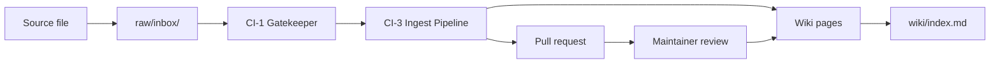

# User Guide

This knowledgebase is a self-contained, version-controlled knowledge system.
It stores curated information as wiki pages backed by traceable source evidence.
Everything lives in a single Git repository — sources go in, wiki pages come
out, and every claim links back to the evidence that supports it.

## How content flows through the system



1. A contributor adds a source file to the inbox.
2. CI-1 validates the push and hands off to CI-3.
3. CI-3 runs the ingest pipeline: parses the source, generates wiki pages,
   rebuilds the index, and opens a pull request.
4. A maintainer reviews and merges the PR.
5. The wiki pages are live and browsable.

---

## Reading the wiki

The wiki is the curated output of the knowledgebase. You can read it without
installing anything.

### Browse on GitHub

Open [`wiki/index.md`](../wiki/index.md) in your browser. The index lists
every page grouped by type:

- **Sources** — ingested source documents with metadata
- **Entities** — people, organizations, tools, and other named things
- **Concepts** — ideas, patterns, and domain terminology
- **Analyses** — investigative write-ups and comparisons

Click any link to read the full page.

### Search with qmd (local)

If you have [qmd](https://github.com/quanmind/qmd) installed locally, you can
run semantic queries against the wiki:

```bash
qmd collection add wiki --name wiki
qmd embed
qmd query "your question here"
```

This builds a local vector index and returns ranked results from the wiki
content.

### GitHub Pages

The wiki is deployed as a browsable website at
**<https://wryenmeek.com/knowledgebase/>**. The `pages.yml` workflow builds
the MkDocs Material site and publishes it to GitHub Pages on every push.

### Understanding wiki pages

Every wiki page has YAML frontmatter at the top with metadata that helps you
evaluate what you are reading:

| Field | What it means |
|---|---|
| `type` | The kind of page: `source`, `entity`, `concept`, or `analysis`. |
| `title` | The canonical display name. |
| `status` | Lifecycle state: `active` (current), `superseded` (replaced by a newer page), or `archived` (retained for history). |
| `confidence` | Evidence strength from 1 (minimal) to 5 (strong, multi-source). This reflects how well-supported the claims are, not how certain the author feels. |
| `sensitivity` | Handling level: `public`, `internal`, or `restricted`. |
| `sources` | List of SourceRef citations that back the page's claims. Each links to a specific file, commit, and checksum. |
| `open_questions` | Unresolved gaps or contradictions — things the page acknowledges it does not yet answer. |
| `tags` | Topic labels for discovery. |

Pages also follow a standard section structure:

- **Summary** — a brief overview of the page content.
- **Evidence** — the detailed body, grounded in cited sources.
- **Open Questions** — explicit gaps flagged for future work.

---

## Using the knowledgebase with GitHub Copilot

The knowledgebase includes specialized AI agents and skills that you can use
through GitHub Copilot Chat (in VS Code, on GitHub.com, or in the Copilot CLI).

### Ask questions

Use `@query-synthesist` to ask questions. It reads the wiki first, then
synthesizes a cited answer:

```
@query-synthesist What is the ingest pipeline?
```

The agent returns an answer with citations pointing to specific wiki pages. If
the answer is valuable enough, it can be persisted as a new wiki page through
the governance pipeline.

### Explore and orient

| Agent | What it does |
|---|---|
| `@query-synthesist` | Answers questions from the curated wiki with citations. |
| `@knowledgebase-orchestrator` | Routes work through the correct governance lane. Start here when contributing through an agent. |
| `@maintenance-auditor` | Checks for stale, orphaned, or outdated content. |
| `@quality-analyst` | Assesses coverage gaps and prioritizes curation work. |

### User-facing skills

Skills are reusable workflows you can invoke directly. Most skills are internal
to the governance pipeline, but a few are designed for interactive use:

| Skill | How to use it | What it does |
|---|---|---|
| `grill-me` | Ask Copilot to invoke `grill-me` with your plan or spec | Stress-tests your plan through relentless one-at-a-time questioning until every decision branch is resolved. |
| `idea-refine` | Ask Copilot to invoke `idea-refine` with your idea | Refines ideas through structured divergent and convergent thinking. |
| `zoom-out` | Ask Copilot to invoke `zoom-out` on unfamiliar code or wiki areas | Maps the relevant modules, callers, and abstractions to help you understand how things connect. |
| `edit-article` | Ask Copilot to invoke `edit-article` on a wiki page | Improves prose clarity and structure without changing facts or citations. |

The full list of skills is in `.github/skills/`.

---

## Contributing knowledge

You can add new knowledge to the system by placing source files in the inbox.
The automated pipeline handles the rest.

### What to contribute

Any document that contains knowledge worth preserving: research notes, meeting
summaries, design proposals, technical references, policy documents, or
external content you want to curate.

### Supported formats

| Format | Extension |
|---|---|
| Markdown | `.md` |
| Plain text | `.txt` |
| HTML | `.html` |
| PDF | `.pdf` |

Markdown is the primary format. Other formats are converted to markdown during
ingest.

### How to submit a source

1. **Create your file.** Use a descriptive filename with hyphens
   (e.g., `database-migration-plan.md`). Start with a `# Title` heading and
   write plain markdown. No special frontmatter is required — the pipeline
   generates the metadata automatically.

2. **Add it to the inbox.**

```bash
   cp your-file.md raw/inbox/
   git add raw/inbox/your-file.md
   git commit -m "Add source: your-file"
   git push
```

3. **Watch the pipeline.** Go to the **Actions** tab on GitHub:
   - **CI-1 Gatekeeper** validates your push (should pass in under a minute).
   - **CI-3 PR Producer** runs the ingest pipeline and opens a pull request
     with the generated wiki pages.

4. **Wait for review.** A maintainer reviews the PR. Once merged, your content
   is part of the wiki.

### If something goes wrong

- **CI-1 fails:** Your push included files that the gatekeeper flagged as
  sensitive (workflow files, scripts, etc.). Separate your inbox additions from
  other changes into different commits.
- **CI-3 fails:** The ingest pipeline could not process your source. Check the
  Actions log for the error reason. Common causes: malformed markdown, missing
  title heading, or a duplicate source that was previously rejected.
- **Source was rejected:** The system maintains a rejection registry. If your
  source was rejected previously, a maintainer needs to run the
  `reconsider-rejected-source` workflow before it can be resubmitted.

If you are unsure, open a GitHub issue or ask `@knowledgebase-orchestrator` in
Copilot Chat for guidance.

### Tips for good sources

- **One topic per file.** A focused source produces a cleaner wiki page.
- **Use clear headings.** The ingest pipeline uses your heading structure.
- **Include dates and attribution.** This helps the system assign confidence
  and track freshness.
- **Link to external references.** If your source cites external material,
  include the URLs — they become part of the evidence chain.

---

## Operating the knowledgebase

This section covers the essentials for maintainers. For the full operational
procedures, see the [MVP Runbook](mvp-runbook.md).

### Run ingest manually

```bash
python3 scripts/kb/ingest.py \
  --source raw/inbox/your-file.md \
  --wiki-root wiki \
  --schema AGENTS.md \
  --report-json
```

### Rebuild the index

```bash
python3 scripts/kb/update_index.py --wiki-root wiki --write
```

### Validate wiki governance

```bash
python3 .github/skills/validate-wiki-governance/logic/validate_wiki_governance.py
```

Add `--validator freshness-threshold` to include page-age checking.

### Run the test suite

```bash
python3 -m pytest tests/ -q
```

### CI pipeline overview

| CI | What it does | Trigger |
|---|---|---|
| **CI-1** | Validates inbox pushes and hands off to CI-3 | Push to `main` touching `raw/inbox/**` |
| **CI-2** | Read-only diagnostics (lint, tests, security scans) | Push, pull request, or manual |
| **CI-3** | Runs ingest and opens a PR with wiki updates | CI-1 handoff or manual dispatch |
| **CI-4** | Writes staged agent-generated content to `docs/` and `.github/skills/` | Manual dispatch (approval-gated) |
| **CI-5** | Monitors GitHub source repositories for drift | Scheduled or manual |
| **CI-6** | Monitors Google Drive sources for drift | Scheduled or manual |

### Further reading

- [Architecture overview](architecture.md) — system design and governance model
- [MVP Runbook](mvp-runbook.md) — full operational procedures and CI fallback paths
- [ADR index](decisions/README.md) — architectural decision records
